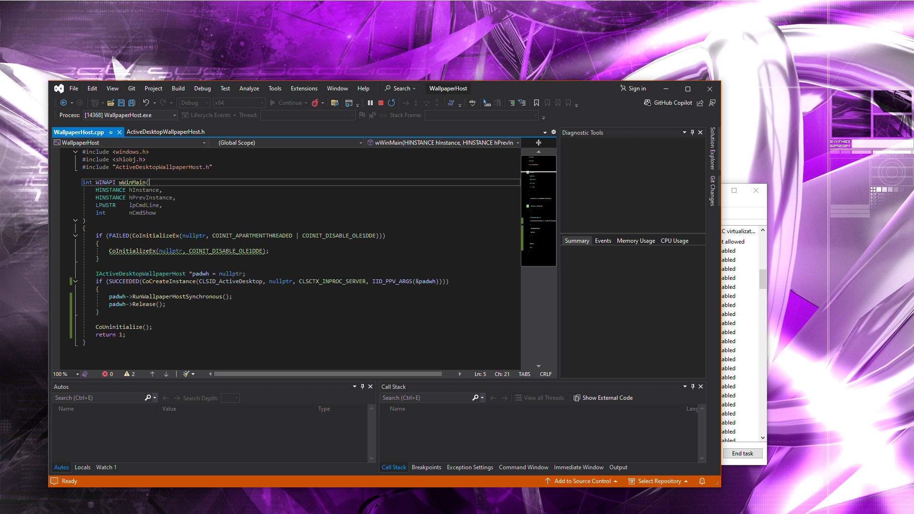

# WallpaperHost
This repository contains the source code to a reverse engineered WallpaperHost.exe from Windows 10.
This is mainly to document the interface that creates the wallpaper window since Windows 8, such
that it can be used in other projects.

## In action
